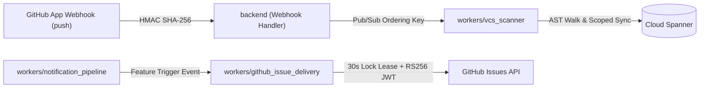

# webstatus-code-subscriptions

This skill provides comprehensive guidance for developing, testing, and maintaining the **Code Subscriptions** subsystem in `webstatus.dev`.

## 1. Overview & Architecture

Code Subscriptions enable engineering teams to track Web Platform features directly inside their source code repositories (e.g., GitHub) using standard `TODO` comment directives like `// TODO(baseline/popover): remove modal polyfill`.

## 2. Canonical Directive Syntax & Configuration (Rick Viscomi Guidance)

### 2.1 Supported Comment Syntax

Developers use standard, intuitive `TODO` comments without custom DSL syntax:

- **Standard Baseline Widely (Default / Replacement)**:
  `// TODO(baseline/popover): remove modal fallback`
  `// TODO(web-feature: subgrid): upgrade grid layout`
  - _Trigger_: Emits when the feature reaches **Baseline Widely Available** (`feature_baseline_to_widely`).
- **Progressive Enhancement (Newly Available)**:
  `// TODO(baseline/view-transitions, newly): add page transition animation`
  - _Trigger_: Emits immediately when the feature reaches **Baseline Newly Available** (`feature_baseline_to_newly`, interoperable across all 4 major engines).
- **Multi-Language Comments**:
  - JS/TS: `// TODO(baseline/popover): ...` or `/* TODO(baseline/popover): ... */`
  - CSS: `/* TODO(baseline/anchor-positioning): ... */`
  - HTML / Templates: `<!-- TODO(baseline/dialog): ... -->`
  - Hash / Config: `# TODO(baseline/subgrid): ...`

## 3. Core Subsystem Components

1. **Security & Cryptography (`lib/netutil`, `lib/gh`)**:
   - `SafeDialer`: SSRF defense with socket-level `Control` inspection, DNS rebinding TOCTOU protection, and private CIDR/IPv4-mapped IPv6 blocking.
   - `crypto/subtle.ConstantTimeCompare`: Constant-time verification of `X-Hub-Signature-256`.
   - `github.com/golang-jwt/jwt/v5`: RS256 JWT generation with `jwt.ParseRSAPrivateKeyFromPEM` eliminating unsafe type assertions.
   - `sync.RWMutex`: Thread-safe token caching with double-checked refresh locking, avoiding `any` or reflection overhead.

2. **AST Comment Directive Parser (`lib/codescan`)**:
   - Scans source files (`.js`, `.ts`, `.jsx`, `.tsx`, `.css`, `.scss`, `.html`, `.vue`, `.svelte`, `.astro`).
   - Parses `TODO(baseline/<id>)` and `TODO(baseline/<id>, newly)` with linear-time RE2 regular expressions.
   - File size safety limit: Skips files exceeding 1MB (1,048,576 bytes) or lines $>2,000$ characters.

3. **Spanner Multi-VCS Persistence (`lib/gcpspanner`)**:
   - Provider discriminators (`VCSProvider`, `VCSRepositoryID`, `VCSInstallationID`).
   - Scoped synchronization (`SynchronizeRepositoryCodeSubscriptions`) using transaction-safe upsert/delete sets.
   - Atomic 30-second lock leasing (`LockExpiresAt`) on `CodeSubscriptions`.
   - Polymorphic delivery tracking in `CodeSubscriptionDeliveries`.

4. **Worker Daemons (`workers/vcs_scanner`, `workers/github_issue_delivery`)**:
   - `vcs_scanner`: Pulls git trees from GitHub API, extracts AST occurrences, and updates Spanner with monotonic timestamp fencing.
   - `github_issue_delivery`: Acquires delivery lock, renders issue markdown with commit SHA permalinks and Modern Web Guidance refactoring prompts, creates GitHub issue, and marks subscription `DELIVERED`.

5. **Frontend UI (`frontend/src/static/js/components`)**:
   - `<webstatus-code-subscriptions-page>`: Lit web component consuming `@lit/task` for async state.
   - Route: `/settings/code-subscriptions` with backward-compatible redirect safety net for `/settings/subscriptions?tab=code-subscriptions`.

## 4. Development Guidelines & Invariants

- **Multi-VCS Readiness**: Always use `(vcs_provider, repository_id)` as composite keys in database and API operations.
- **Worker Lock Leases**: If an external API call fails with transient rate limits (403/429), reset `LockExpiresAt = NULL` before returning NACK to avoid deadlock.
- **Pub/Sub Partitioning**: Always format Pub/Sub `OrderingKey` as `vcs:<provider>:repo:<repo_id>` for strict FIFO sequencing.
- **BOLA / IDOR Defense**: Always return standard `404 Not Found` for unauthorized private repository queries.
- **Lean Telemetry**: All metrics and lifecycle tracking are handled directly via **Cloud Spanner** and **Google Cloud Monitoring** (no BigQuery required).

## 5. Architectural Learnings & Spanner Best Practices

### 6.1 Natural Key Persistence via `entityWriterWithIDRetrieval`

When persisting entities identified externally by natural unique keys (e.g. `(VCSProvider, VCSInstallationID)`) while using internal Spanner UUID primary keys, avoid manual pre-queries or ad-hoc `if in.ID == ""` checks. Use `entityWriterWithIDRetrieval` (matching `Groups`, `Snapshots`, and `ChromiumHistogramEnums`):

- Natural key mapper implements `writeableEntityMapperWithIDRetrieval` (`GetKeyFromExternal`, `SelectOne`, `GetID`, `GetIDFromInternal`, `NewEntityWithID`, `Merge`).
- Executes lookups, merges, and inserts inside a single atomic Spanner `ReadWriteTransaction`.

### 6.2 Typed String Enums & Defensive Deserialization

All domain models use strongly-typed string enums (`VCSProvider`, `SubscriptionStatus`, `DeliveryChannel`, `ScanStatus`). In all `to*()` deserialization methods from Spanner:

- Never use naked type casts on database strings.
- Validate strings against enum constants using explicit `parse*` helper functions (`parseVCSProvider`, `parseSubscriptionStatus`, `parseDeliveryStatus`, `parseDeliveryChannel`, `parseScanStatus`) before constructing domain structs or unmarshaling polymorphic JSON.

### 6.3 Streamlined Testing & Boundary Protection

- **No Redundant Mapper Boilerplate**: Do not write standalone unit tests testing `Table()` or query parameter names; Spanner emulator tests (`TestClient_*`) exercise 100% of mapper query construction.
- **Unit Test Boundaries**: Keep unit tests strictly focused on polymorphic JSON serialization/deserialization branches, nil pointer safety, and non-nil slice guarantees.

### 6.4 Generated Bindings Standard (PR #2749)

All generated Go and TypeScript OpenAPI/JSON Schema bindings under `lib/gen/` must be generated (`make openapi` / `make gen`) and committed directly in Git on the branch introducing schema changes.

### 6.5 Exhaustive Enum Linting & Type-Safe Testing

- **Exhaustive Enum Switches Without `default:`**:
  When parsing or mapping typed domain enums, structure `switch enumVal { ... }` blocks with explicit `case` branches for every defined constant and no `default:` branch. Make the unhandled/fallback case the trailing `return` of the function. This triggers `golangci-lint`'s `exhaustive` linter if new enum constants are added in the future without updated parser cases.
- **Type-Safe OpenAPI Handler Verification**:
  In HTTP handler unit tests, avoid runtime type assertions like `resp.(backend.ListCodeSubscriptions200JSONResponse)`. Instead, pass an `httptest.NewRecorder()` into `resp.Visit*Response(rec)` and assert status codes and payload contents on `rec.Code` and `rec.Body`.

### 6.6 Declarative GitOps Single Source of Truth

- **Code is Truth**: Subscriptions lifecycle is strictly declarative based on source code comments. Manual `DELETE /v1/code-subscriptions/{id}` endpoints are intentionally omitted.
- **Obsolescence & Revival**:
  - Directives deleted from code automatically transition to `OBSOLETE` in Spanner upon webhook push scan.
  - Directives restored in code automatically revive to `ACTIVE`.

### 6.7 Token Provider Architecture & Valkey Caching

- **Interface Decoupling**: Consumers (workers) accept `gh.InstallationTokenProvider` and `gh.TokenCacher` interfaces.
- **Valkey Shared Caching**: GitHub App installation tokens are cached in Valkey under key `github:installation_token:<id>` with a 50-minute TTL (GitHub tokens have a 60-minute lifetime), preventing race conditions or expired token reuse across worker instances.
- **JWT Lifespan**: Minted JWTs use `IssuedAt: now.Add(-60 * time.Second)` and `ExpiresAt: now.Add(9 * time.Minute)` ensuring a valid lifespan within GitHub's 600s ceiling.

### 6.8 Comment Parser Toolability & Ad-hoc CLI Readiness

- `codescan.Directive` exposes JSON serialization tags (`json:"feature_id"`, `json:"trigger"`, `json:"line_number"`, `json:"comment_snippet"`) and `codescan.ParseReader(r io.Reader, filename string)` to allow building standalone developer CLIs or CI linters without filesystem coupling.
- Regular expressions use `FindAllStringSubmatch` to detect multiple directives placed within the same comment block or line.

### 6.9 Versioned Pub/Sub Event Envelopes (`lib/event/`)

All background messages and Pub/Sub task payloads must strictly use the versioned envelope system:

- **Dedicated Versioned Packages**: Every event payload resides in `lib/event/<event_name>/<version>/types.go` (e.g., `lib/event/codescantask/v1`, `lib/event/githubissuedelivery/v1`).
- **`event.Event` Interface**: Every event struct must implement `Kind() string` and `APIVersion() string`.
- **Envelope Publishing**: All publishers must wrap payloads using `event.New[T Event](payload T)` rather than raw `json.Marshal`.
- **Leaf Package Decoupling**: Event packages in `lib/event/` must be pure leaf transport DTOs and must **NEVER** import `lib/gcpspanner` or `lib/backendtypes`. Never place broker messages in `backendtypes` or ad-hoc worker packages.

### 6.10 Strict Layering & Defensive Enum Conversions

- **Layer Isolation**: `lib/backendtypes` is an abstract interface package and must **NEVER** import `lib/gcpspanner`. Database-to-OpenAPI DTO translations belong exclusively in `lib/gcpspanner/spanneradapters/`.
- **Exhaustive Enum Switches**: Direct type-casting across boundaries (e.g. `gcpspanner.VCSProvider(str)` or `backend.CodeSubscriptionResponseStatus(status)`) is strictly forbidden. Always use exhaustive `switch` functions (`toSpanner*`, `toBackend*`) that validate known enum constants and return sentinel errors (`ErrUnsupportedVCSProvider`, `ErrUnknownSubscriptionStatus`, `ErrUnknownSubscriptionTrigger`) on unrecognized values.
