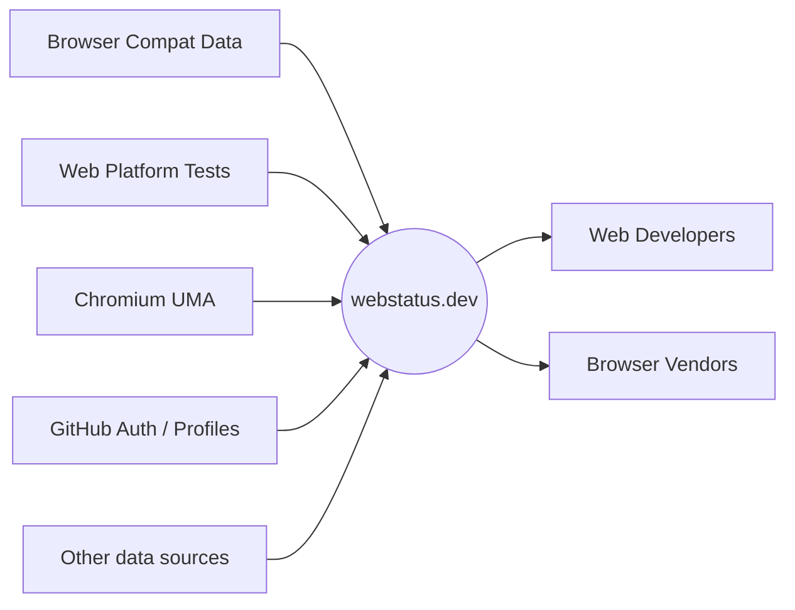
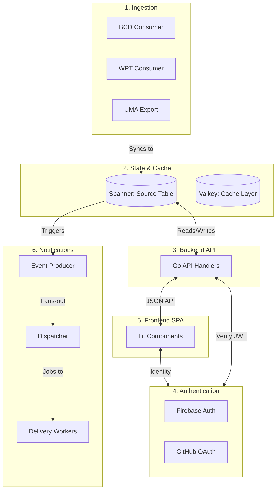
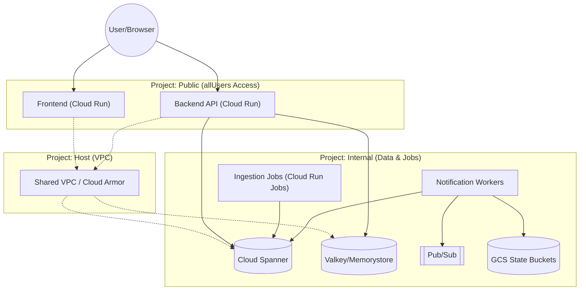
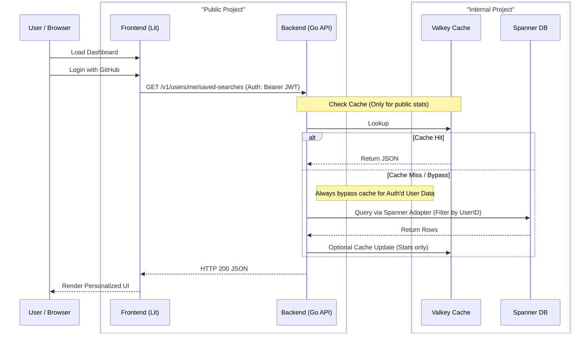
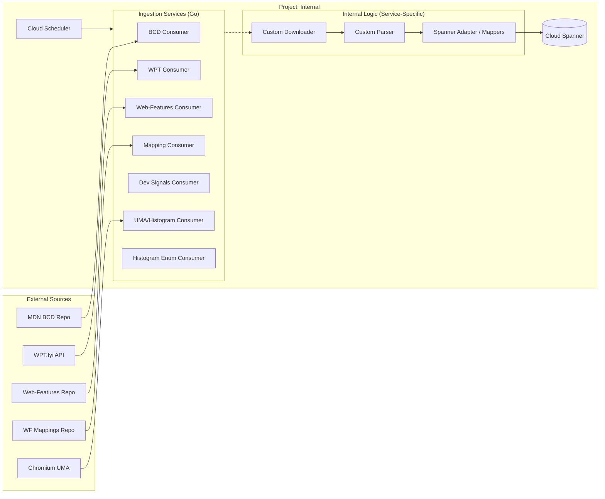
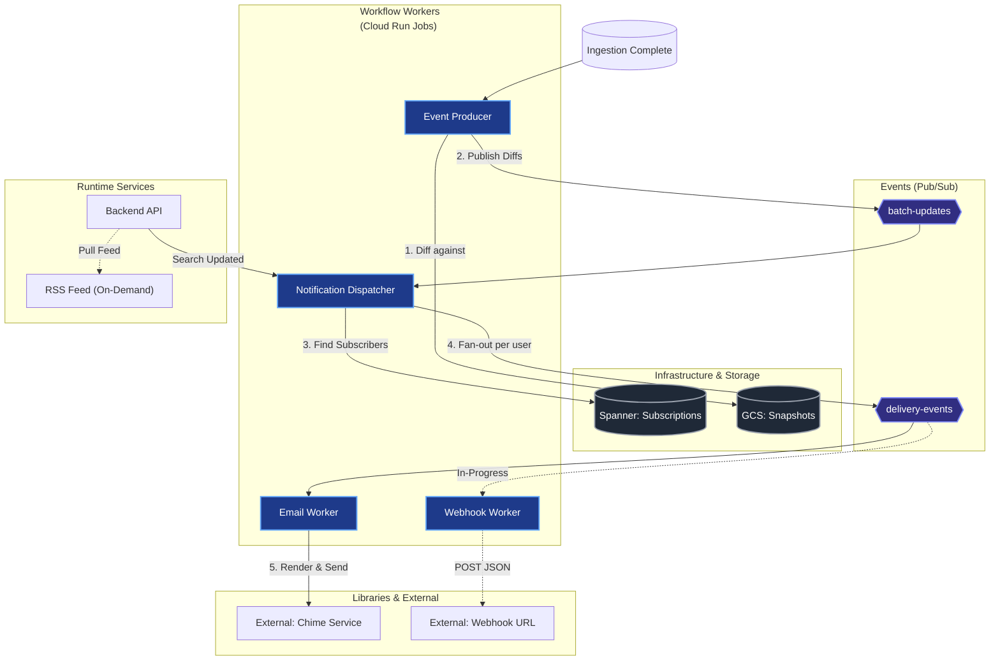
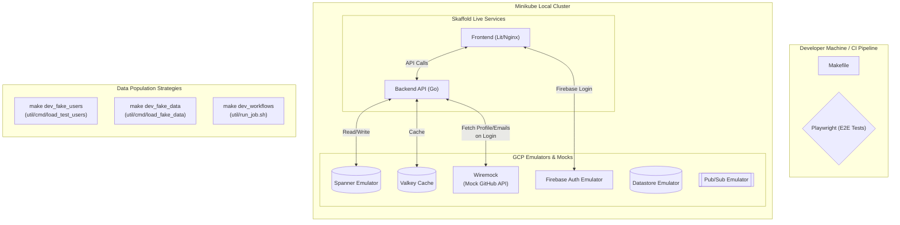
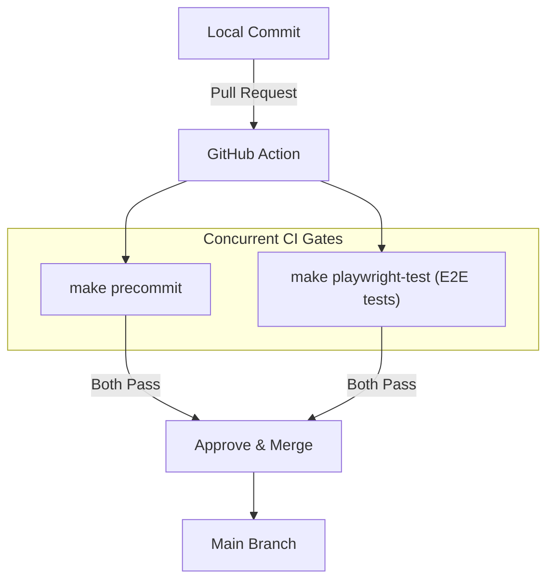

# Webstatus.dev Architecture

This document contains high-level architectural diagrams for the webstatus.dev ecosystem. These diagrams are intended to help new developers understand the system boundaries, data flows, and local development environment.

---

## Functional Architecture (Core Blocks)

This diagram identifies the major system boundaries and their primary responsibilities.

---

For a detailed database schema overview, see the [Generated Spanner Documentation](schema/README.md).

_Note: The nodes in these diagrams are clickable! Click on a component to jump to its source code or relevant GCP documentation._

---

## 1. High-Level Architecture (Multi-Project Setup)

To limit the scope of the `allUsers` IAM permission (which makes the frontend and API public), the infrastructure is split across three GCP projects. This **Security Isolation** ensures that even if a public-facing service is compromised, the primary database and ingestion state remain protected behind VPC Service Controls and Shared VPC networking.

### Core Ecosystem Entities

Before diving into the diagrams, it is helpful to understand the core domain entities:

- **Feature**: The atomic unit of tracking (e.g., "WebAssembly", "CSS Grid"). Derived from the `web-features` repo.
- **Run**: A specific execution of Web Platform Tests for a browser/version.
- **Metric**: Passing/Failing stats (from WPT) or real-world usage percentages (from UMA).
- **Snapshot**: A GCS-stored record of search results at a point in time, used for cross-job diffing.
- **Saved Search**: A persistent user query (e.g., "Baseline: Widely") that triggers notifications.
- **Notification Channel**: A delivery target for alerts (Email or Web Push).

### Authentication & User Identity

User accounts and identity are managed via **GitHub OAuth**, bridged by **Firebase Auth**.

> [!TIP]
> **Implementation Details**: For technical details on JWT verification middleware and frontend login handshake logic, refer to the [Backend Architecture Guide](../skills/webstatus-backend/references/architecture.md) and [Frontend Architecture Guide](../skills/webstatus-frontend/references/architecture.md).

---

## 2. Public-to-Internal Request Flow

This diagram illustrates how a user's request travels from the browser, hits the public-facing API, and securely queries the internal database using the Spanner Adapter pattern.

> [!TIP]
> **Implementation Details**: For the specific Go handlers, ANTLR parser technicalities, and caching code, refer to the [Backend Implementation Guide](../skills/webstatus-backend/references/architecture.md) and [Search Grammar Guide](../skills/webstatus-search-grammar/references/architecture.md).

---

## 3. Storage & Infrastructure (Verified Setup)

The project leverages managed GCP services, networked for isolation in the `internal` project.

### Service Connectivity Matrix

| Component        | GCP Service          | Connectivity Pattern                  | Terraform Link                              |
| :--------------- | :------------------- | :------------------------------------ | :------------------------------------------ |
| **Database**     | Spanner              | Public API (via IAM/VPC-SC)           | [spanner.tf](../infra/storage/spanner.tf)   |
| **Cache**        | Memorystore (Valkey) | **Private Service Connect (PSC)**     | [valkey.tf](../infra/storage/valkey.tf)     |
| **Managed APIs** | Google Services      | **VPC Peering** (`servicenetworking`) | [network/main.tf](../infra/network/main.tf) |
| **Storage**      | GCS                  | Authenticated API                     | [storage/](../infra/storage/)               |

> [!IMPORTANT]
> **VPC Peering vs PSC**: We use VPC Peering for general Google Managed Services communication, but **Private Service Connect (PSC)** is specifically used for the Valkey instance to provide dedicated, secure endpoints within our subnets.

## 4. Data Ingestion Pipeline (Internal Project)

Webstatus.dev relies heavily on external data. Cloud Scheduler triggers jobs that download, parse, and synchronize this data into our Spanner database.

> [!TIP]
> **Implementation Details**: For the full list of data source schemas and job orchestration patterns, refer to the [Ingestion Implementation Guide](../skills/webstatus-ingestion/references/architecture.md).

---

## 5. Notification System Architecture (Event-Driven)

When ingestion jobs complete, the system triggers a fan-out process to notify users. This architecture strictly separates **Change Detection** (Delta) from **Subscription Matching** (Dispatch) and **Delivery** (Worker).

> [!NOTE]
> **Push vs On-Demand Pull**: While most notifications are pushed (Email, Webhooks), the system is designed to also support **On-Demand Pull** channels (e.g., RSS, API Feeds) one day. The general idea: these are still subscription-bound but bypass the push dispatcher, instead being served via the API layer when requested by the client.

> [!TIP]
> **Technical Deep-Dive**: For code-level implementation choreography (struct types, differ logic, and versioning patterns), refer to the [Worker Architecture Guide](../skills/webstatus-workers/references/architecture.md) in the workers skill. This document focuses on the high-level system topology.

#### Nuance: Email Delivery Adapters

Currently, the system uses the [Chime Adapter](../lib/email/chime) for production delivery. However, the architecture is designed to support an **SMTP Adapter** in the future. This would allow developers to point local workers at a tool like Mailhog or Mailtrap for end-to-end testing without needing a real Chime environment.

#### Notification Component Roles

| Type        | Name                      | Purpose                                                                                    |
| :---------- | :------------------------ | :----------------------------------------------------------------------------------------- |
| **Worker**  | `event_producer`          | Detects deltas between current Spanner state and last GCS snapshot.                        |
| **Event**   | `batch-updates`           | High-level event containing the search ID and a summary of what changed.                   |
| **Worker**  | `notification_dispatcher` | The "Fan-Out" engine. Finds all subscribers for a search and creates unique delivery jobs. |
| **Event**   | `delivery-events`         | Individual job for a specific user and channel (Go Canonical Type).                        |
| **Worker**  | `email_worker`            | Renders templates using `lib/email` and delivers via the Chime adapter.                    |
| **Library** | `lib/email`               | Shared HTML templates and Go mappers for email rendering.                                  |

---

> [!TIP]
> **Implementation Details**: For the technical deep-dives into Event Producer diffing, Dispatcher fan-out, and Email rendering logic, refer to the [Worker Implementation Guide](../skills/webstatus-workers/references/architecture.md).

> [!NOTE]
> **Implementation Details**: For an in-depth look at how versioned blobs are parsed using the `SummaryVisitor` pattern, refer to the [Worker Implementation Guide](../skills/webstatus-workers/references/architecture.md#3-schema-evolution--the-summaryvisitor).

---

---

## 6. Local Development & E2E Testing Environment

Understanding the local dev loop is crucial. We use Skaffold and Minikube to orchestrate live services alongside GCP emulators. The `Makefile` provides targets to populate these emulators with either _fake data_ (for deterministic E2E testing) or _live data_ (for manual workflow testing).

> [!TIP]
> **Implementation Details**: For a deep-dive into the local dev loop, E2E population scripts, and the CI gate logic, refer to the [E2E & CI Architecture Guide](../skills/webstatus-e2e/references/architecture.md).

---

### Path to Production (The PR Lifecycle)

Every contribution follows a strict automated validation path before it can be merged into `main`.

---

## 7. Developer Guides & Patterns

For technical patterns and implementation details, refer to the **Gemini Skills** in your IDE:

- **[webstatus-backend](../skills/webstatus-backend/SKILL.md)**: Go API, Spanner mappers, and OpenAPI.
- **[webstatus-frontend](../skills/webstatus-frontend/SKILL.md)**: Lit web components and component testing.
- **[webstatus-e2e](../skills/webstatus-e2e/SKILL.md)**: Playwright E2E testing and debugging.
- **[webstatus-ingestion](../skills/webstatus-ingestion/SKILL.md)**: Scheduled data ingestion workflows.
- **[webstatus-workers](../skills/webstatus-workers/SKILL.md)**: Pub/Sub notification pipeline.
- **[webstatus-search-grammar](../skills/webstatus-search-grammar/SKILL.md)**: ANTLR search query parsing.
- **[webstatus-maintenance](../skills/webstatus-maintenance/SKILL.md)**: Toolchain upgrades and infra maintenance.

---

## 8. Local Environment

Since we use a **Devcontainer**, all engineers get a pre-configured environment with built-in tools for testing and debugging.

- **[docs/debugging.md](debugging.md)**: Using the ANTLR visualizer and attaching debuggers to Go unit tests.
- **[docs/testing.md](testing.md)**: Documentation for Playwright iteration, `make precommit`, and VS Code Test Explorer tips.
