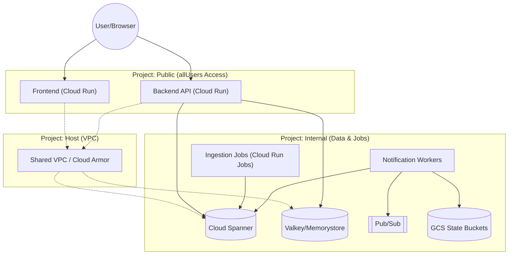
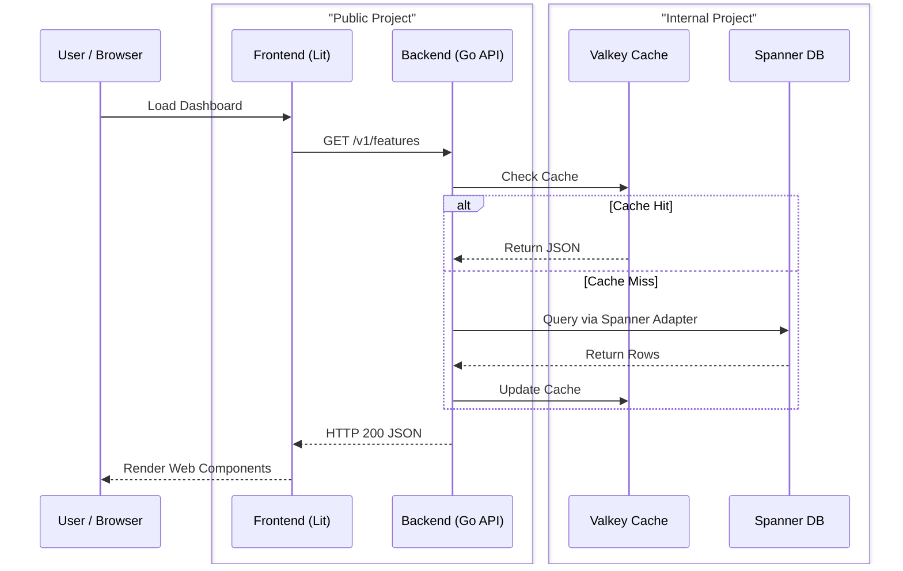
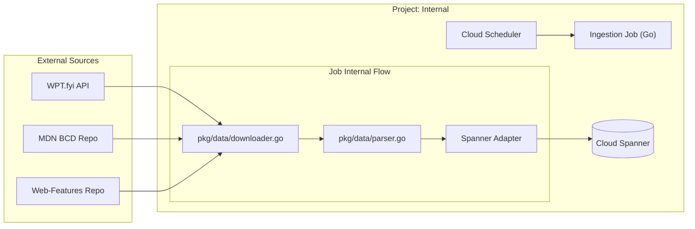
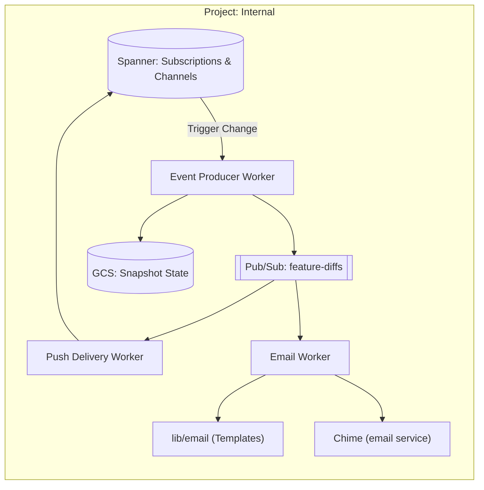
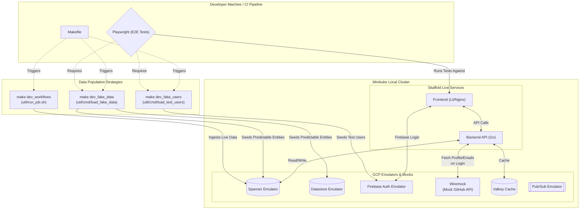

# Webstatus.dev Architecture & Workflows

This document contains high-level architectural diagrams for the webstatus.dev ecosystem. These diagrams are intended to help new developers understand the system boundaries, data flows, and local development environment.

_Note: The nodes in these diagrams are clickable! Click on a component to jump to its source code or relevant GCP documentation._

---

## 1. High-Level Architecture (Multi-Project Setup)

To limit the scope of the `allUsers` IAM permission (which makes the frontend and API public), the infrastructure is split across three GCP projects. They are networked together via a Shared VPC in the Host project.

---

## 2. Public-to-Internal Request Flow

This diagram illustrates how a user's request travels from the browser, hits the public-facing API, and securely queries the internal database using the Spanner Adapter pattern.

_(Note: Sequence diagrams in Mermaid currently have limited support for external hyperlinks on participants, so we rely on the flowchart diagrams for deep-linking.)_

---

## 3. Data Ingestion Pipeline (Internal Project)

Webstatus.dev relies heavily on external data. Cloud Scheduler triggers jobs that download, parse, and synchronize this data into our Spanner database.

---

## 4. Notification System Architecture (Event-Driven)

When data changes (via ingestion workflows) or users update their saved searches, an event-driven architecture processes those changes to deliver email and push notifications.

---

## 5. Local Development & E2E Testing Environment

Understanding the local dev loop is crucial. We use Skaffold and Minikube to orchestrate live services alongside GCP emulators. The `Makefile` provides targets to populate these emulators with either _fake data_ (for deterministic E2E testing) or _live data_ (for manual workflow testing).

