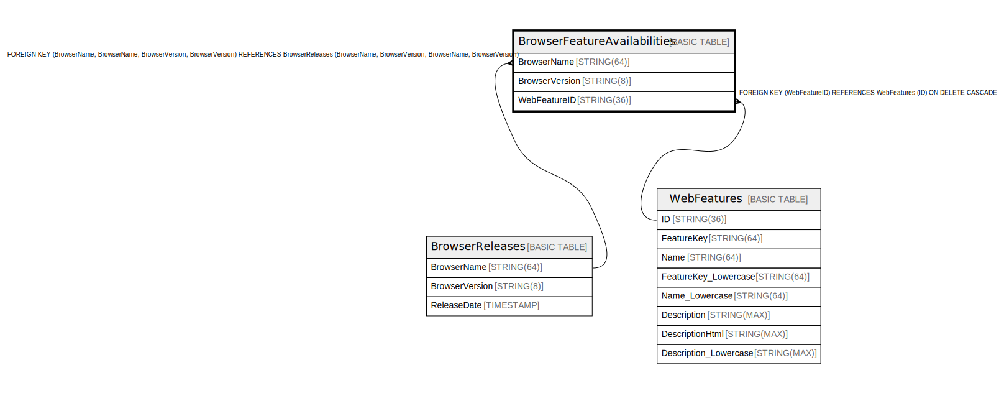

# BrowserFeatureAvailabilities

## Description

## Columns

| Name | Type | Default | Nullable | Children | Parents | Comment |
| ---- | ---- | ------- | -------- | -------- | ------- | ------- |
| BrowserName | STRING(64) |  | false |  | [BrowserReleases](BrowserReleases.md) |  |
| BrowserVersion | STRING(8) |  | false |  | [BrowserReleases](BrowserReleases.md) |  |
| WebFeatureID | STRING(36) |  | false |  | [WebFeatures](WebFeatures.md) |  |

## Constraints

| Name | Type | Definition |
| ---- | ---- | ---------- |
| PRIMARY_KEY | PRIMARY_KEY | PRIMARY KEY(WebFeatureID, BrowserName) |
| FK_BrowserFeatureAvailabilities_BrowserReleases_DDAB0CB4B9DFA076_1 | FOREIGN KEY | FOREIGN KEY (BrowserName, BrowserName, BrowserVersion, BrowserVersion) REFERENCES BrowserReleases (BrowserName, BrowserVersion, BrowserName, BrowserVersion) |
| FK_BrowserFeatureAvailabilitiesWebFeatureID | FOREIGN KEY | FOREIGN KEY (WebFeatureID) REFERENCES WebFeatures (ID) ON DELETE CASCADE |

## Indexes

| Name | Definition |
| ---- | ---------- |
| IDX_BrowserFeatureAvailabilities_BrowserName_BrowserVersion_B348C85B1730D0A3 | CREATE INDEX IDX_BrowserFeatureAvailabilities_BrowserName_BrowserVersion_B348C85B1730D0A3 ON BrowserFeatureAvailabilities (BrowserName, BrowserVersion) |
| UniqueFeatureBrowser | CREATE UNIQUE INDEX UniqueFeatureBrowser ON BrowserFeatureAvailabilities (WebFeatureID, BrowserName) |

## Relations

---

> Generated by [tbls](https://github.com/k1LoW/tbls)
