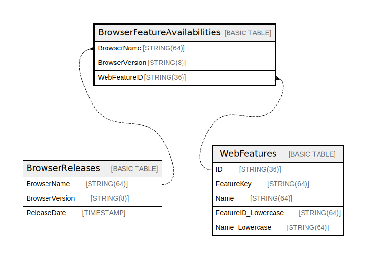

# BrowserFeatureAvailabilities

## Description

## Columns

| Name | Type | Default | Nullable | Children | Parents | Comment |
| ---- | ---- | ------- | -------- | -------- | ------- | ------- |
| BrowserName | STRING(64) |  | false |  | [BrowserReleases](BrowserReleases.md) |  |
| BrowserVersion | STRING(8) |  | false |  | [BrowserReleases](BrowserReleases.md) |  |
| FeatureID | STRING(64) |  | false |  | [WebFeatures](WebFeatures.md) |  |

## Constraints

| Name | Type | Definition |
| ---- | ---- | ---------- |
| PRIMARY_KEY | PRIMARY_KEY | PRIMARY KEY(FeatureID, BrowserName) |

## Indexes

| Name | Definition |
| ---- | ---------- |
| UniqueFeatureBrowser | CREATE UNIQUE INDEX UniqueFeatureBrowser ON BrowserFeatureAvailabilities (FeatureID, BrowserName) |
| IDX_BrowserFeatureAvailabilities_BrowserName_BrowserVersion_CFC73BAB94024D2A | CREATE INDEX IDX_BrowserFeatureAvailabilities_BrowserName_BrowserVersion_CFC73BAB94024D2A ON BrowserFeatureAvailabilities (BrowserName, BrowserVersion) |

## Relations

---

> Generated by [tbls](https://github.com/k1LoW/tbls)
