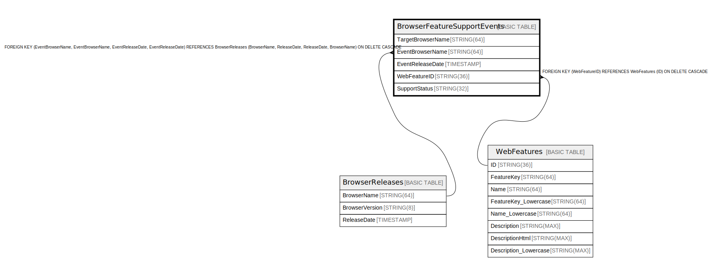

# BrowserFeatureSupportEvents

## Description

## Columns

| Name | Type | Default | Nullable | Children | Parents | Comment |
| ---- | ---- | ------- | -------- | -------- | ------- | ------- |
| TargetBrowserName | STRING(64) |  | false |  |  |  |
| EventBrowserName | STRING(64) |  | false |  | [BrowserReleases](BrowserReleases.md) |  |
| EventReleaseDate | TIMESTAMP |  | false |  | [BrowserReleases](BrowserReleases.md) |  |
| WebFeatureID | STRING(36) |  | false |  | [WebFeatures](WebFeatures.md) |  |
| SupportStatus | STRING(32) |  | false |  |  |  |

## Constraints

| Name | Type | Definition |
| ---- | ---- | ---------- |
| PRIMARY_KEY | PRIMARY_KEY | PRIMARY KEY(TargetBrowserName, EventBrowserName, EventReleaseDate, WebFeatureID) |

## Indexes

| Name | Definition |
| ---- | ---------- |
| BrowserFeatureSupportEvents_OtherBrowserSupported | CREATE INDEX BrowserFeatureSupportEvents_OtherBrowserSupported ON BrowserFeatureSupportEvents (TargetBrowserName, SupportStatus, WebFeatureID, EventReleaseDate) |
| BrowserFeatureSupportEvents_AllFeatureStatusesOnBrowserRelease | CREATE INDEX BrowserFeatureSupportEvents_AllFeatureStatusesOnBrowserRelease ON BrowserFeatureSupportEvents (EventReleaseDate, TargetBrowserName, SupportStatus) |
| IDX_BrowserFeatureSupportEvents_EventBrowserName_EventReleaseDate_06EA997AC00DC328 | CREATE INDEX IDX_BrowserFeatureSupportEvents_EventBrowserName_EventReleaseDate_06EA997AC00DC328 ON BrowserFeatureSupportEvents (EventBrowserName, EventReleaseDate) |
| BrowserFeatureSupportEvents_FeatureStatusOnBrowserRelease | CREATE INDEX BrowserFeatureSupportEvents_FeatureStatusOnBrowserRelease ON BrowserFeatureSupportEvents (WebFeatureID, EventReleaseDate, TargetBrowserName, SupportStatus) |
| IDX_BrowserFeatureSupportEvents_WebFeatureID_E8EB84EB1A5E21CC | CREATE INDEX IDX_BrowserFeatureSupportEvents_WebFeatureID_E8EB84EB1A5E21CC ON BrowserFeatureSupportEvents (WebFeatureID) |
| BrowserFeatureSupportEvents_FeatureStatusPerBrowserRelease | CREATE INDEX BrowserFeatureSupportEvents_FeatureStatusPerBrowserRelease ON BrowserFeatureSupportEvents (TargetBrowserName, WebFeatureID, SupportStatus, EventReleaseDate) |

## Relations

---

> Generated by [tbls](https://github.com/k1LoW/tbls)
