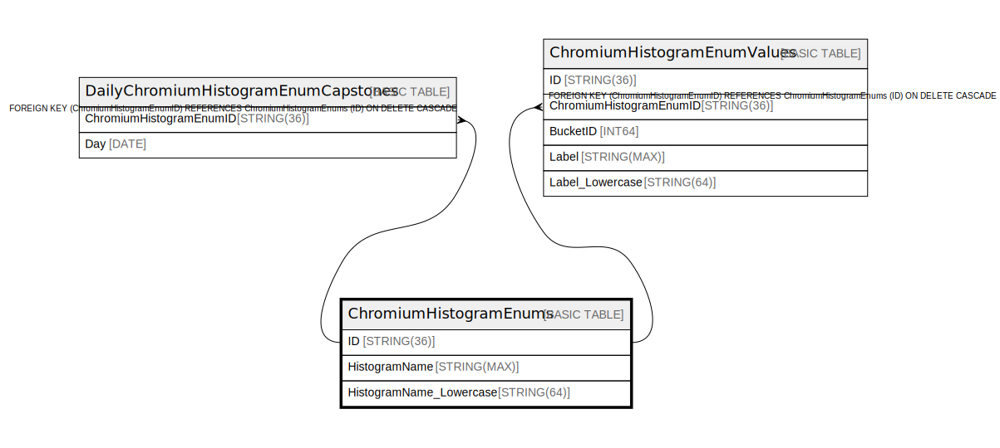

# ChromiumHistogramEnums

## Description

## Columns

| Name | Type | Default | Nullable | Children | Parents | Comment |
| ---- | ---- | ------- | -------- | -------- | ------- | ------- |
| ID | STRING(36) |  | false | [ChromiumHistogramEnumValues](ChromiumHistogramEnumValues.md) [DailyChromiumHistogramEnumCapstones](DailyChromiumHistogramEnumCapstones.md) |  |  |
| HistogramName | STRING(MAX) |  | false |  |  |  |
| HistogramName_Lowercase | STRING(64) |  | true |  |  |  |

## Constraints

| Name | Type | Definition |
| ---- | ---- | ---------- |
| PRIMARY_KEY | PRIMARY_KEY | PRIMARY KEY(ID) |

## Indexes

| Name | Definition |
| ---- | ---------- |
| ChromiumHistogramEnumsByHistogramName | CREATE UNIQUE NULL_FILTERED INDEX ChromiumHistogramEnumsByHistogramName ON ChromiumHistogramEnums (HistogramName) |

## Relations

---

> Generated by [tbls](https://github.com/k1LoW/tbls)
