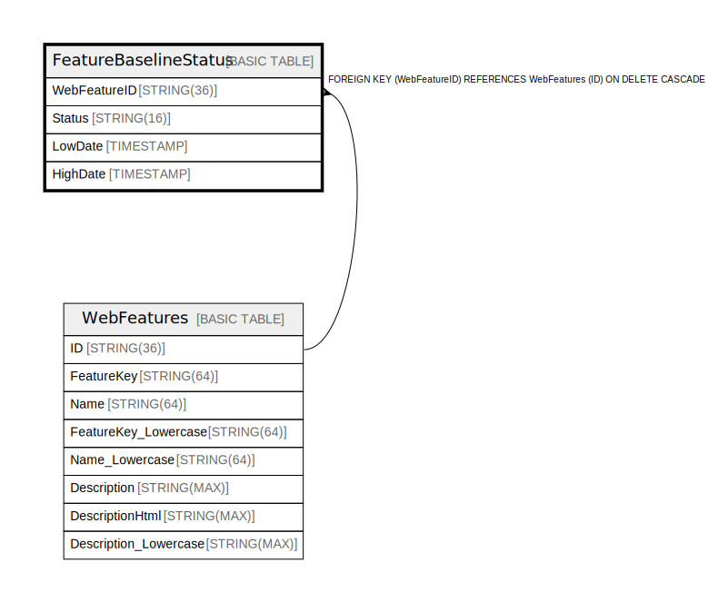

# FeatureBaselineStatus

## Description

## Columns

| Name | Type | Default | Nullable | Children | Parents | Comment |
| ---- | ---- | ------- | -------- | -------- | ------- | ------- |
| FeatureID | STRING(64) |  | false |  | [WebFeatures](WebFeatures.md) |  |
| Status | STRING(16) |  | false |  |  |  |
| LowDate | TIMESTAMP |  | true |  |  |  |
| HighDate | TIMESTAMP |  | true |  |  |  |

## Constraints

| Name | Type | Definition |
| ---- | ---- | ---------- |
| PRIMARY_KEY | PRIMARY_KEY | PRIMARY KEY(FeatureID) |

## Relations

---

> Generated by [tbls](https://github.com/k1LoW/tbls)
