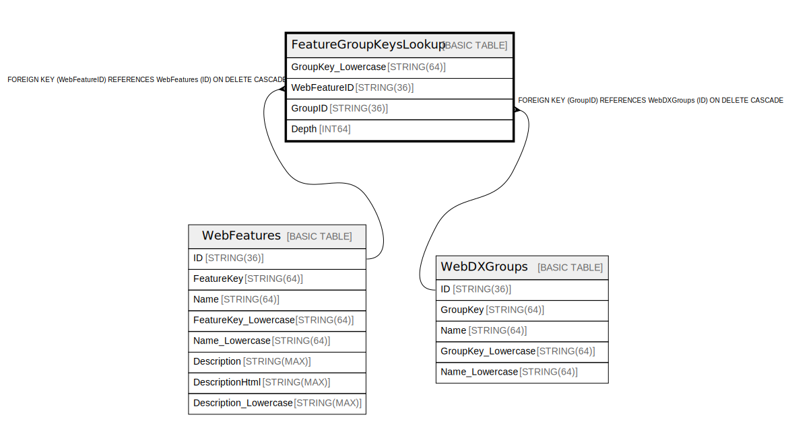

# FeatureGroupKeysLookup

## Description

## Columns

| Name | Type | Default | Nullable | Children | Parents | Comment |
| ---- | ---- | ------- | -------- | -------- | ------- | ------- |
| GroupKey_Lowercase | STRING(64) |  | false |  |  |  |
| WebFeatureID | STRING(36) |  | false |  | [WebFeatures](WebFeatures.md) |  |
| GroupID | STRING(36) |  | false |  | [WebDXGroups](WebDXGroups.md) |  |
| Depth | INT64 |  | false |  |  |  |

## Constraints

| Name | Type | Definition |
| ---- | ---- | ---------- |
| PRIMARY_KEY | PRIMARY_KEY | PRIMARY KEY(GroupKey_Lowercase, WebFeatureID) |

## Indexes

| Name | Definition |
| ---- | ---------- |
| IDX_FeatureGroupKeysLookup_GroupID_0D78392F3EC61CA8 | CREATE INDEX IDX_FeatureGroupKeysLookup_GroupID_0D78392F3EC61CA8 ON FeatureGroupKeysLookup (GroupID) |
| IDX_FeatureGroupKeysLookup_WebFeatureID_859124609C6B5A67 | CREATE INDEX IDX_FeatureGroupKeysLookup_WebFeatureID_859124609C6B5A67 ON FeatureGroupKeysLookup (WebFeatureID) |

## Relations

---

> Generated by [tbls](https://github.com/k1LoW/tbls)
