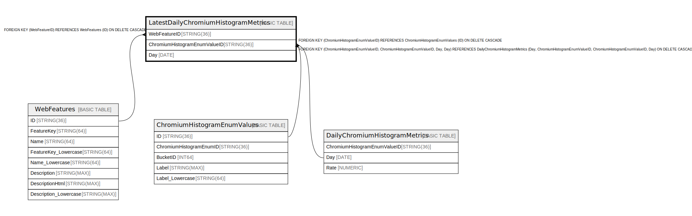

# LatestDailyChromiumHistogramMetrics

## Description

## Columns

| Name | Type | Default | Nullable | Children | Parents | Comment |
| ---- | ---- | ------- | -------- | -------- | ------- | ------- |
| WebFeatureID | STRING(36) |  | false |  | [WebFeatures](WebFeatures.md) |  |
| ChromiumHistogramEnumValueID | STRING(36) |  | false |  | [ChromiumHistogramEnumValues](ChromiumHistogramEnumValues.md) [DailyChromiumHistogramMetrics](DailyChromiumHistogramMetrics.md) |  |
| Day | DATE |  | false |  | [DailyChromiumHistogramMetrics](DailyChromiumHistogramMetrics.md) |  |

## Constraints

| Name | Type | Definition |
| ---- | ---- | ---------- |
| PRIMARY_KEY | PRIMARY_KEY | PRIMARY KEY(WebFeatureID, ChromiumHistogramEnumValueID) |
| FK_LatestDailyChromiumHistogramMetrics_ChromiumHistogramEnumValues_4239195E774CD387_1 | FOREIGN KEY | FOREIGN KEY (ChromiumHistogramEnumValueID) REFERENCES ChromiumHistogramEnumValues (ID) ON DELETE CASCADE |
| FK_LatestDailyChromiumHistogramMetricsWebFeatureID | FOREIGN KEY | FOREIGN KEY (WebFeatureID) REFERENCES WebFeatures (ID) ON DELETE CASCADE |
| FK_LatestDailyChromiumHistogramMetrics_DailyChromiumHistogramMetrics_5906648AE91E8014_1 | FOREIGN KEY | FOREIGN KEY (ChromiumHistogramEnumValueID, ChromiumHistogramEnumValueID, Day, Day) REFERENCES DailyChromiumHistogramMetrics (Day, ChromiumHistogramEnumValueID, ChromiumHistogramEnumValueID, Day) ON DELETE CASCADE |

## Indexes

| Name | Definition |
| ---- | ---------- |
| IDX_LatestDailyChromiumHistogramMetrics_ChromiumHistogramEnumValueID_8E8E4F9702E8AADD | CREATE INDEX IDX_LatestDailyChromiumHistogramMetrics_ChromiumHistogramEnumValueID_8E8E4F9702E8AADD ON LatestDailyChromiumHistogramMetrics (ChromiumHistogramEnumValueID) |
| IDX_LatestDailyChromiumHistogramMetrics_ChromiumHistogramEnumValueID_Day_87694E42C69AF881 | CREATE INDEX IDX_LatestDailyChromiumHistogramMetrics_ChromiumHistogramEnumValueID_Day_87694E42C69AF881 ON LatestDailyChromiumHistogramMetrics (ChromiumHistogramEnumValueID, Day) |

## Relations

---

> Generated by [tbls](https://github.com/k1LoW/tbls)
