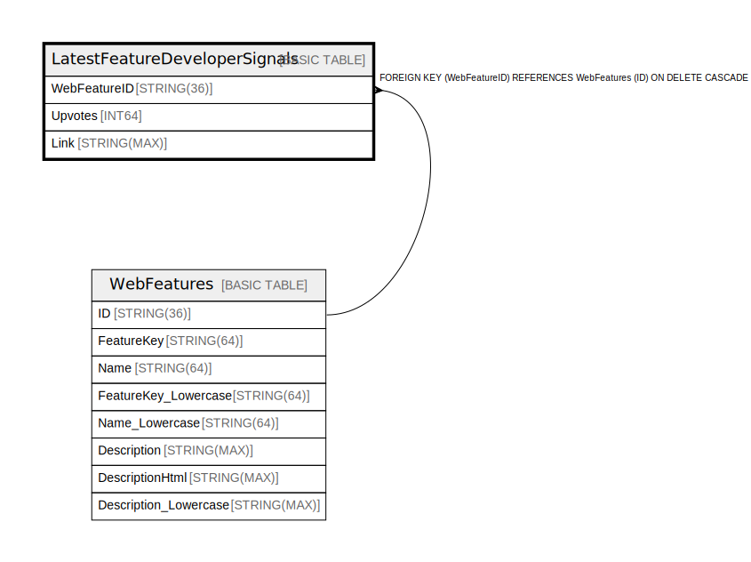

# LatestFeatureDeveloperSignals

## Description

## Columns

| Name | Type | Default | Nullable | Children | Parents | Comment |
| ---- | ---- | ------- | -------- | -------- | ------- | ------- |
| WebFeatureID | STRING(36) |  | false |  | [WebFeatures](WebFeatures.md) |  |
| Upvotes | INT64 |  | false |  |  |  |
| Link | STRING(MAX) |  | false |  |  |  |

## Constraints

| Name | Type | Definition |
| ---- | ---- | ---------- |
| PRIMARY_KEY | PRIMARY_KEY | PRIMARY KEY(WebFeatureID) |
| FK_LatestFeatureDeveloperSignals_WebFeatures_3C67D28AA745F0C4_1 | FOREIGN KEY | FOREIGN KEY (WebFeatureID) REFERENCES WebFeatures (ID) ON DELETE CASCADE |

## Relations

---

> Generated by [tbls](https://github.com/k1LoW/tbls)
