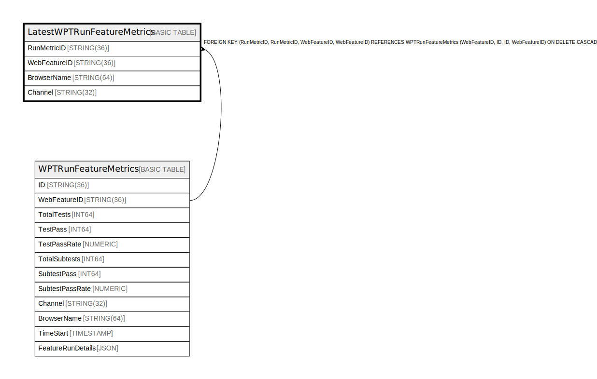

# LatestWPTRunFeatureMetrics

## Description

## Columns

| Name | Type | Default | Nullable | Children | Parents | Comment |
| ---- | ---- | ------- | -------- | -------- | ------- | ------- |
| RunMetricID | STRING(36) |  | false |  | [WPTRunFeatureMetrics](WPTRunFeatureMetrics.md) |  |
| WebFeatureID | STRING(36) |  | false |  | [WPTRunFeatureMetrics](WPTRunFeatureMetrics.md) |  |
| BrowserName | STRING(64) |  | false |  |  |  |
| Channel | STRING(32) |  | false |  |  |  |

## Constraints

| Name | Type | Definition |
| ---- | ---- | ---------- |
| PRIMARY_KEY | PRIMARY_KEY | PRIMARY KEY(WebFeatureID, BrowserName, Channel) |

## Indexes

| Name | Definition |
| ---- | ---------- |
| IDX_LatestWPTRunFeatureMetrics_RunMetricID_WebFeatureID_21BAEC9D6B82A79E | CREATE INDEX IDX_LatestWPTRunFeatureMetrics_RunMetricID_WebFeatureID_21BAEC9D6B82A79E ON LatestWPTRunFeatureMetrics (RunMetricID, WebFeatureID) |

## Relations

---

> Generated by [tbls](https://github.com/k1LoW/tbls)
