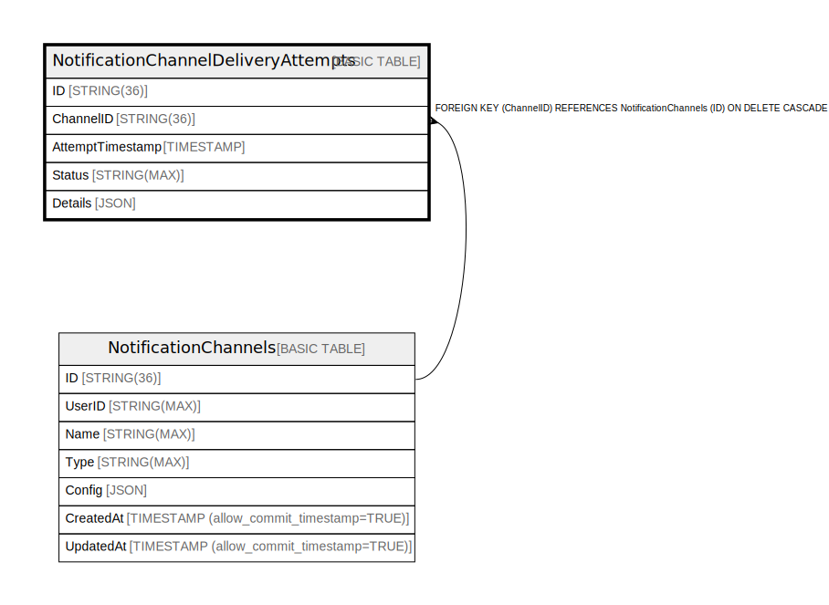

# NotificationChannelDeliveryAttempts

## Description

## Columns

| Name | Type | Default | Nullable | Children | Parents | Comment |
| ---- | ---- | ------- | -------- | -------- | ------- | ------- |
| ID | STRING(36) |  | false |  |  |  |
| ChannelID | STRING(36) |  | false |  |  |  |
| AttemptTimestamp | TIMESTAMP |  | false |  |  |  |
| Status | STRING(MAX) |  | false |  |  |  |
| Details | JSON |  | true |  |  |  |

## Constraints

| Name | Type | Definition |
| ---- | ---- | ---------- |
| PRIMARY_KEY | PRIMARY_KEY | PRIMARY KEY(ID, ChannelID) |

## Indexes

| Name | Definition |
| ---- | ---------- |
| IDX_NotificationChannelDeliveryAttempts_ChannelID_63C7D928059106C8 | CREATE INDEX IDX_NotificationChannelDeliveryAttempts_ChannelID_63C7D928059106C8 ON NotificationChannelDeliveryAttempts (ChannelID) |
| IX_NotificationChannelDeliveryAttempt_AttemptTimestamp | CREATE INDEX IX_NotificationChannelDeliveryAttempt_AttemptTimestamp ON NotificationChannelDeliveryAttempts (ChannelID, AttemptTimestamp) |

## Relations

---

> Generated by [tbls](https://github.com/k1LoW/tbls)
