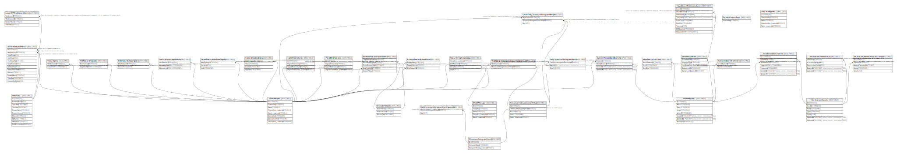

# projects/local/instances/local/databases/local

## Tables

| Name | Columns | Comment | Type |
| ---- | ------- | ------- | ---- |
| [WPTRunFeatureMetrics](WPTRunFeatureMetrics.md) | 11 |  | BASIC TABLE |
| [BrowserReleases](BrowserReleases.md) | 3 |  | BASIC TABLE |
| [WebFeatures](WebFeatures.md) | 5 |  | BASIC TABLE |
| [BrowserFeatureAvailabilities](BrowserFeatureAvailabilities.md) | 3 |  | BASIC TABLE |
| [WPTRuns](WPTRuns.md) | 10 |  | BASIC TABLE |
| [FeatureBaselineStatus](FeatureBaselineStatus.md) | 4 |  | BASIC TABLE |

## Relations

---

> Generated by [tbls](https://github.com/k1LoW/tbls)
