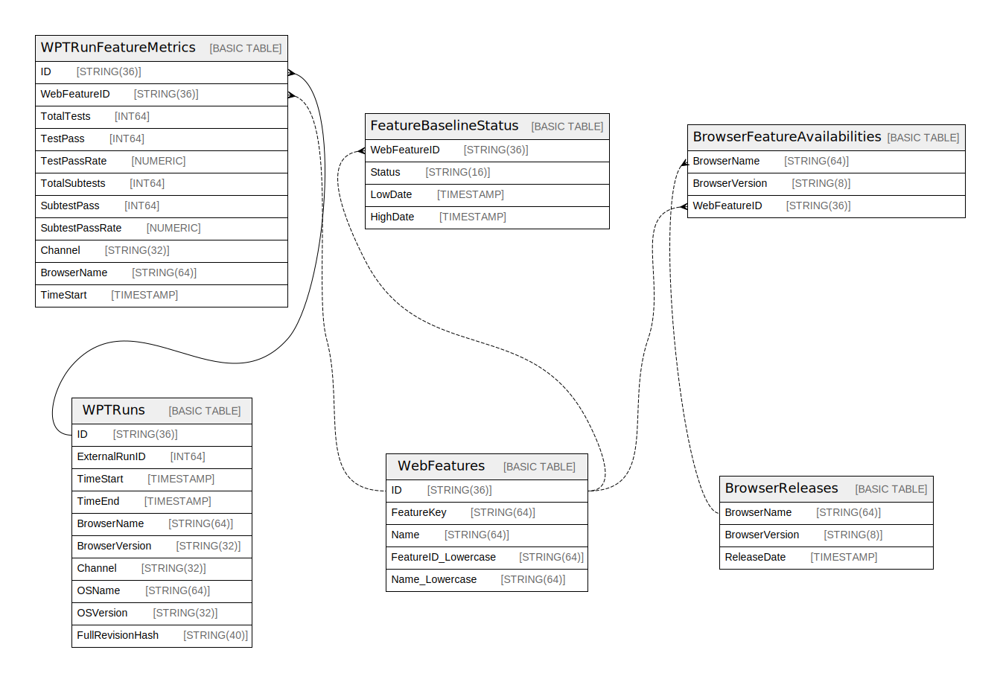

# projects/local/instances/local/databases/local

## Tables

| Name | Columns | Comment | Type |
| ---- | ------- | ------- | ---- |
| [WPTRunFeatureMetrics](WPTRunFeatureMetrics.md) | 12 |  | BASIC TABLE |
| [ExcludedFeatureKeys](ExcludedFeatureKeys.md) | 1 |  | BASIC TABLE |
| [WebDXSnapshots](WebDXSnapshots.md) | 5 |  | BASIC TABLE |
| [WebFeatureChromiumHistogramEnumValues](WebFeatureChromiumHistogramEnumValues.md) | 2 |  | BASIC TABLE |
| [SavedSearchUserRoles](SavedSearchUserRoles.md) | 3 |  | BASIC TABLE |
| [FeatureDiscouragedDetails](FeatureDiscouragedDetails.md) | 3 |  | BASIC TABLE |
| [LatestFeatureDeveloperSignals](LatestFeatureDeveloperSignals.md) | 3 |  | BASIC TABLE |
| [NotificationChannelDeliveryAttempts](NotificationChannelDeliveryAttempts.md) | 5 |  | BASIC TABLE |
| [SystemManagedSavedSearches](SystemManagedSavedSearches.md) | 4 |  | BASIC TABLE |
| [WPTRuns](WPTRuns.md) | 10 |  | BASIC TABLE |
| [FeatureBaselineStatus](FeatureBaselineStatus.md) | 4 |  | BASIC TABLE |
| [WebDXGroups](WebDXGroups.md) | 5 |  | BASIC TABLE |
| [ChromiumHistogramEnumValues](ChromiumHistogramEnumValues.md) | 5 |  | BASIC TABLE |
| [SavedSearches](SavedSearches.md) | 8 |  | BASIC TABLE |
| [LatestDailyChromiumHistogramMetrics](LatestDailyChromiumHistogramMetrics.md) | 3 |  | BASIC TABLE |
| [SplitWebFeatures](SplitWebFeatures.md) | 4 |  | BASIC TABLE |
| [NotificationChannelStates](NotificationChannelStates.md) | 5 |  | BASIC TABLE |
| [SavedSearchNotificationEvents](SavedSearchNotificationEvents.md) | 9 |  | BASIC TABLE |
| [WebFeatures](WebFeatures.md) | 8 |  | BASIC TABLE |
| [BrowserFeatureAvailabilities](BrowserFeatureAvailabilities.md) | 3 |  | BASIC TABLE |
| [LatestWPTRunFeatureMetrics](LatestWPTRunFeatureMetrics.md) | 4 |  | BASIC TABLE |
| [ChromiumHistogramEnums](ChromiumHistogramEnums.md) | 3 |  | BASIC TABLE |
| [DailyChromiumHistogramEnumCapstones](DailyChromiumHistogramEnumCapstones.md) | 2 |  | BASIC TABLE |
| [BrowserFeatureSupportEvents](BrowserFeatureSupportEvents.md) | 5 |  | BASIC TABLE |
| [MovedWebFeatures](MovedWebFeatures.md) | 4 |  | BASIC TABLE |
| [NotificationChannels](NotificationChannels.md) | 7 |  | BASIC TABLE |
| [SavedSearchState](SavedSearchState.md) | 5 |  | BASIC TABLE |
| [BrowserReleases](BrowserReleases.md) | 3 |  | BASIC TABLE |
| [FeatureSpecs](FeatureSpecs.md) | 2 |  | BASIC TABLE |
| [WebFeatureSnapshots](WebFeatureSnapshots.md) | 2 |  | BASIC TABLE |
| [DailyChromiumHistogramMetrics](DailyChromiumHistogramMetrics.md) | 3 |  | BASIC TABLE |
| [UserSavedSearchBookmarks](UserSavedSearchBookmarks.md) | 2 |  | BASIC TABLE |
| [FeatureGroupKeysLookup](FeatureGroupKeysLookup.md) | 4 |  | BASIC TABLE |
| [WebFeaturesMappingData](WebFeaturesMappingData.md) | 2 |  | BASIC TABLE |
| [SavedSearchSubscriptions](SavedSearchSubscriptions.md) | 7 |  | BASIC TABLE |

## Relations

---

> Generated by [tbls](https://github.com/k1LoW/tbls)
