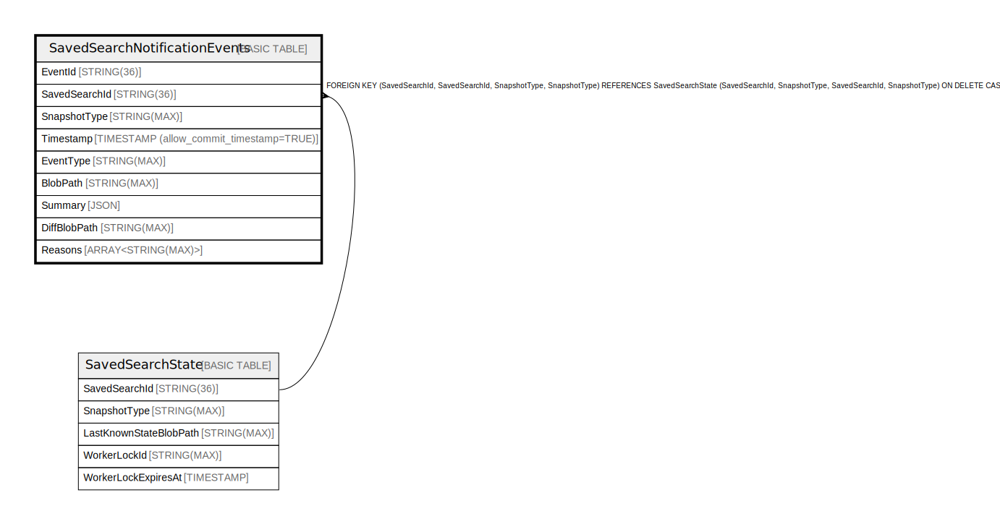

# SavedSearchNotificationEvents

## Description

## Columns

| Name | Type | Default | Nullable | Children | Parents | Comment |
| ---- | ---- | ------- | -------- | -------- | ------- | ------- |
| EventId | STRING(36) |  | false |  |  |  |
| SavedSearchId | STRING(36) |  | false |  |  |  |
| SnapshotType | STRING(MAX) |  | false |  |  |  |
| Timestamp | TIMESTAMP (allow_commit_timestamp=TRUE) |  | false |  |  |  |
| EventType | STRING(MAX) |  | false |  |  |  |
| BlobPath | STRING(MAX) |  | false |  |  |  |
| Summary | JSON |  | true |  |  |  |
| DiffBlobPath | STRING(MAX) |  | true |  |  |  |
| Reasons | ARRAY<STRING(MAX)> |  | true |  |  |  |

## Constraints

| Name | Type | Definition |
| ---- | ---- | ---------- |
| PRIMARY_KEY | PRIMARY_KEY | PRIMARY KEY(EventId) |

## Indexes

| Name | Definition |
| ---- | ---------- |
| SavedSearchNotificationEvents_BySearchAndType | CREATE INDEX SavedSearchNotificationEvents_BySearchAndType ON SavedSearchNotificationEvents (SavedSearchId, EventType, Timestamp) |
| SavedSearchNotificationEvents_BySearchAndSnapshotType | CREATE INDEX SavedSearchNotificationEvents_BySearchAndSnapshotType ON SavedSearchNotificationEvents (SavedSearchId, SnapshotType, Timestamp) |
| IDX_SavedSearchNotificationEvents_SavedSearchId_SnapshotType_DA904570C69F9709 | CREATE INDEX IDX_SavedSearchNotificationEvents_SavedSearchId_SnapshotType_DA904570C69F9709 ON SavedSearchNotificationEvents (SavedSearchId, SnapshotType) |

## Relations

---

> Generated by [tbls](https://github.com/k1LoW/tbls)
