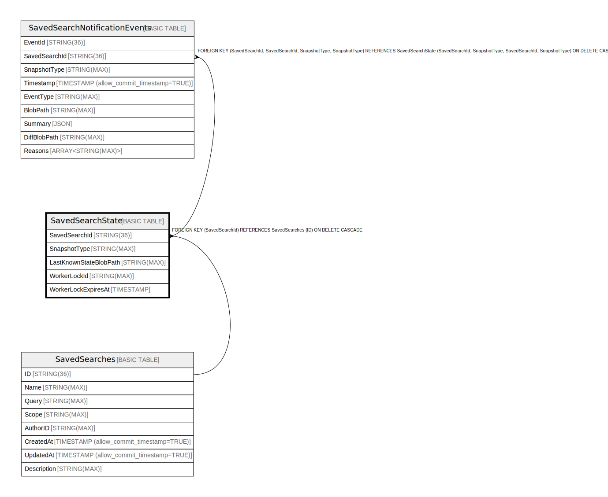

# SavedSearchState

## Description

## Columns

| Name | Type | Default | Nullable | Children | Parents | Comment |
| ---- | ---- | ------- | -------- | -------- | ------- | ------- |
| SavedSearchId | STRING(36) |  | false |  | [SavedSearches](SavedSearches.md) |  |
| SnapshotType | STRING(MAX) |  | false |  |  |  |
| LastKnownStateBlobPath | STRING(MAX) |  | true |  |  |  |
| WorkerLockId | STRING(MAX) |  | true |  |  |  |
| WorkerLockExpiresAt | TIMESTAMP |  | true |  |  |  |

## Constraints

| Name | Type | Definition |
| ---- | ---- | ---------- |
| PRIMARY_KEY | PRIMARY_KEY | PRIMARY KEY(SavedSearchId, SnapshotType) |

## Relations

---

> Generated by [tbls](https://github.com/k1LoW/tbls)
