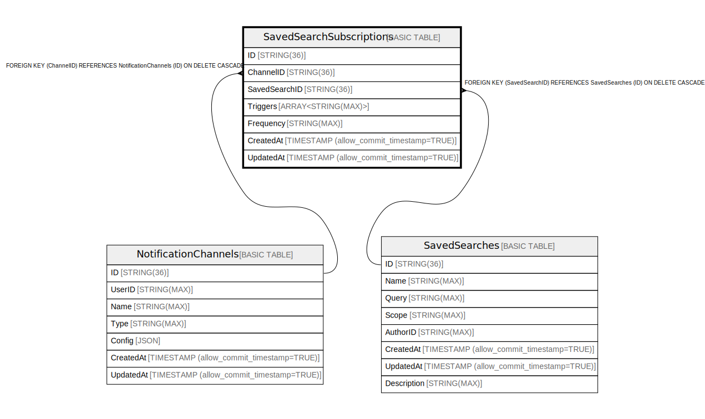

# SavedSearchSubscriptions

## Description

## Columns

| Name | Type | Default | Nullable | Children | Parents | Comment |
| ---- | ---- | ------- | -------- | -------- | ------- | ------- |
| ID | STRING(36) |  | false |  |  |  |
| ChannelID | STRING(36) |  | false |  | [NotificationChannels](NotificationChannels.md) |  |
| SavedSearchID | STRING(36) |  | false |  | [SavedSearches](SavedSearches.md) |  |
| Triggers | ARRAY<STRING(MAX)> |  | true |  |  |  |
| Frequency | STRING(MAX) |  | true |  |  |  |
| CreatedAt | TIMESTAMP (allow_commit_timestamp=TRUE) |  | false |  |  |  |
| UpdatedAt | TIMESTAMP (allow_commit_timestamp=TRUE) |  | false |  |  |  |

## Constraints

| Name | Type | Definition |
| ---- | ---- | ---------- |
| PRIMARY_KEY | PRIMARY_KEY | PRIMARY KEY(ID) |
| FK_SavedSearchSubscription_SavedSearches | FOREIGN KEY | FOREIGN KEY (SavedSearchID) REFERENCES SavedSearches (ID) ON DELETE CASCADE |
| FK_SavedSearchSubscription_NotificationChannel | FOREIGN KEY | FOREIGN KEY (ChannelID) REFERENCES NotificationChannels (ID) ON DELETE CASCADE |

## Indexes

| Name | Definition |
| ---- | ---------- |
| IDX_SavedSearchSubscriptions_ChannelID_ED11BB66145994C6 | CREATE INDEX IDX_SavedSearchSubscriptions_ChannelID_ED11BB66145994C6 ON SavedSearchSubscriptions (ChannelID) |
| IDX_SavedSearchSubscriptions_SavedSearchID_7E2D06D853F55B67 | CREATE INDEX IDX_SavedSearchSubscriptions_SavedSearchID_7E2D06D853F55B67 ON SavedSearchSubscriptions (SavedSearchID) |

## Relations

---

> Generated by [tbls](https://github.com/k1LoW/tbls)
