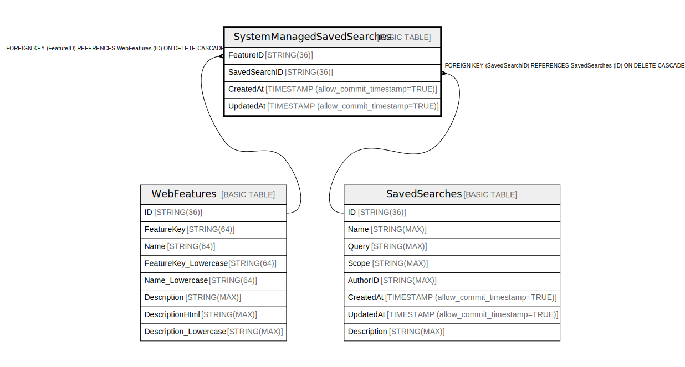

# SystemManagedSavedSearches

## Description

## Columns

| Name | Type | Default | Nullable | Children | Parents | Comment |
| ---- | ---- | ------- | -------- | -------- | ------- | ------- |
| FeatureID | STRING(36) |  | false |  | [WebFeatures](WebFeatures.md) |  |
| SavedSearchID | STRING(36) |  | false |  | [SavedSearches](SavedSearches.md) |  |
| CreatedAt | TIMESTAMP (allow_commit_timestamp=TRUE) |  | false |  |  |  |
| UpdatedAt | TIMESTAMP (allow_commit_timestamp=TRUE) |  | false |  |  |  |

## Constraints

| Name | Type | Definition |
| ---- | ---- | ---------- |
| PRIMARY_KEY | PRIMARY_KEY | PRIMARY KEY(FeatureID) |
| FK_SystemManagedSavedSearches_WebFeatures | FOREIGN KEY | FOREIGN KEY (FeatureID) REFERENCES WebFeatures (ID) ON DELETE CASCADE |
| FK_SystemManagedSavedSearches_SavedSearches | FOREIGN KEY | FOREIGN KEY (SavedSearchID) REFERENCES SavedSearches (ID) ON DELETE CASCADE |

## Indexes

| Name | Definition |
| ---- | ---------- |
| IDX_SystemManagedSavedSearches_SavedSearchID_EE7E01CDEC0F3BBA | CREATE INDEX IDX_SystemManagedSavedSearches_SavedSearchID_EE7E01CDEC0F3BBA ON SystemManagedSavedSearches (SavedSearchID) |
| IX_SystemManagedSavedSearches_SavedSearchId | CREATE UNIQUE INDEX IX_SystemManagedSavedSearches_SavedSearchId ON SystemManagedSavedSearches (SavedSearchID) |

## Relations

---

> Generated by [tbls](https://github.com/k1LoW/tbls)
