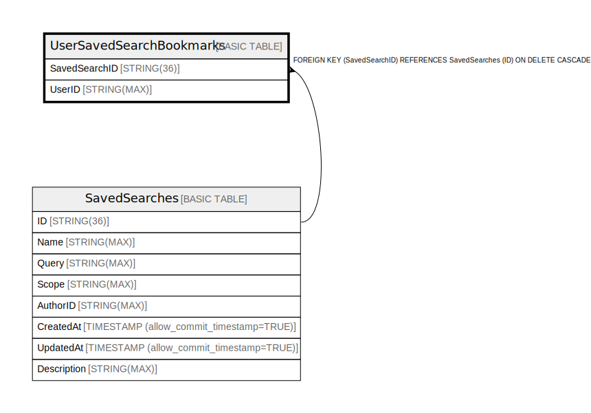

# UserSavedSearchBookmarks

## Description

## Columns

| Name | Type | Default | Nullable | Children | Parents | Comment |
| ---- | ---- | ------- | -------- | -------- | ------- | ------- |
| SavedSearchID | STRING(36) |  | false |  | [SavedSearches](SavedSearches.md) |  |
| UserID | STRING(MAX) |  | false |  |  |  |

## Constraints

| Name | Type | Definition |
| ---- | ---- | ---------- |
| PRIMARY_KEY | PRIMARY_KEY | PRIMARY KEY(UserID, SavedSearchID) |

## Indexes

| Name | Definition |
| ---- | ---------- |
| IDX_UserSavedSearchBookmarks_SavedSearchID_6E2FD5FBD97C2E35 | CREATE INDEX IDX_UserSavedSearchBookmarks_SavedSearchID_6E2FD5FBD97C2E35 ON UserSavedSearchBookmarks (SavedSearchID) |

## Relations

---

> Generated by [tbls](https://github.com/k1LoW/tbls)
