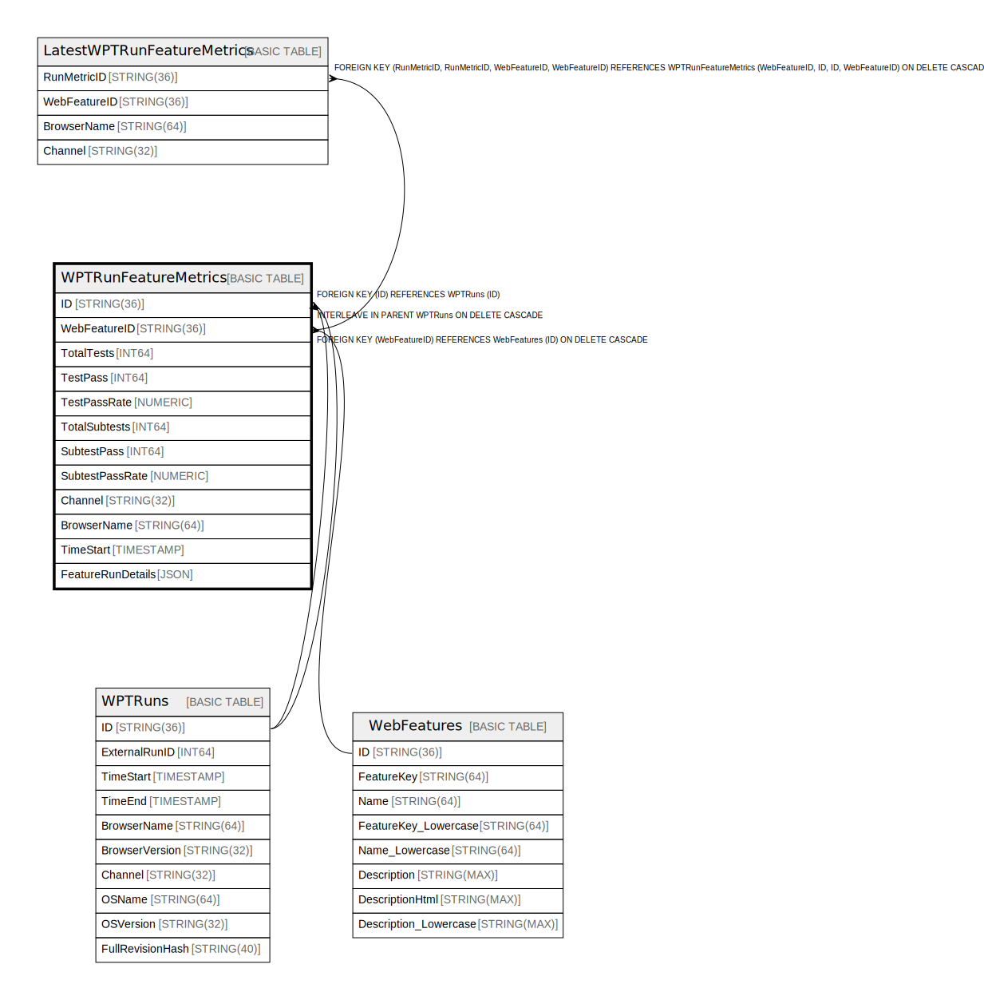

# WPTRunFeatureMetrics

## Description

## Columns

| Name | Type | Default | Nullable | Children | Parents | Comment |
| ---- | ---- | ------- | -------- | -------- | ------- | ------- |
| ID | STRING(36) |  | false |  | [WPTRuns](WPTRuns.md) |  |
| FeatureID | STRING(64) |  | false |  | [WPTRuns](WPTRuns.md) [WebFeatures](WebFeatures.md) |  |
| TotalTests | INT64 |  | true |  |  |  |
| TestPass | INT64 |  | true |  |  |  |
| PassRate | NUMERIC |  | true |  |  |  |
| Channel | STRING(32) |  | false |  |  |  |
| BrowserName | STRING(64) |  | false |  |  |  |
| TimeStart | TIMESTAMP |  | false |  |  |  |

## Constraints

| Name | Type | Definition |
| ---- | ---- | ---------- |
| PRIMARY_KEY | PRIMARY_KEY | PRIMARY KEY(ID, FeatureID) |
| INTERLEAVE | INTERLEAVE | INTERLEAVE IN PARENT WPTRuns ON DELETE CASCADE |

## Indexes

| Name | Definition |
| ---- | ---------- |
| MetricsFeatureChannelBrowserTimePassRate | CREATE INDEX MetricsFeatureChannelBrowserTimePassRate ON WPTRunFeatureMetrics (FeatureID, Channel, BrowserName, TimeStart, PassRate) |
| MetricsFeatureChannelBrowserTime | CREATE INDEX MetricsFeatureChannelBrowserTime ON WPTRunFeatureMetrics (FeatureID, Channel, BrowserName, TimeStart) |
| MetricsByRunIDAndFeature | CREATE UNIQUE NULL_FILTERED INDEX MetricsByRunIDAndFeature ON WPTRunFeatureMetrics (ID, FeatureID) |
| IDX_WPTRunFeatureMetrics_FeatureID_648C5C9695C4049C | CREATE INDEX IDX_WPTRunFeatureMetrics_FeatureID_648C5C9695C4049C ON WPTRunFeatureMetrics (FeatureID) |

## Relations

---

> Generated by [tbls](https://github.com/k1LoW/tbls)
