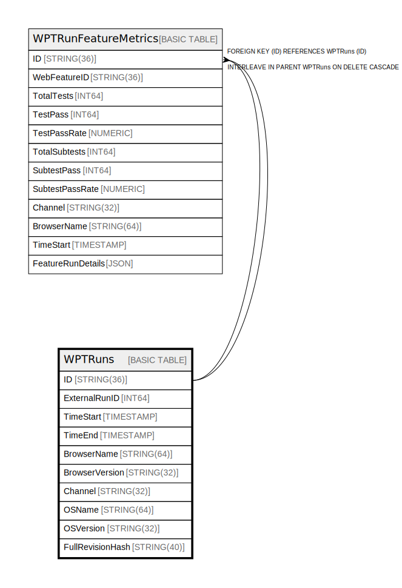

# WPTRuns

## Description

## Columns

| Name | Type | Default | Nullable | Children | Parents | Comment |
| ---- | ---- | ------- | -------- | -------- | ------- | ------- |
| ID | STRING(36) |  | false | [WPTRunFeatureMetrics](WPTRunFeatureMetrics.md) |  |  |
| ExternalRunID | INT64 |  | false |  |  |  |
| TimeStart | TIMESTAMP |  | false |  |  |  |
| TimeEnd | TIMESTAMP |  | false |  |  |  |
| BrowserName | STRING(64) |  | false |  |  |  |
| BrowserVersion | STRING(32) |  | false |  |  |  |
| Channel | STRING(32) |  | false |  |  |  |
| OSName | STRING(64) |  | true |  |  |  |
| OSVersion | STRING(32) |  | true |  |  |  |
| FullRevisionHash | STRING(40) |  | true |  |  |  |

## Constraints

| Name | Type | Definition |
| ---- | ---- | ---------- |
| PRIMARY_KEY | PRIMARY_KEY | PRIMARY KEY(ID) |

## Indexes

| Name | Definition |
| ---- | ---------- |
| RunsForFeatureSearchWithChannel | CREATE INDEX RunsForFeatureSearchWithChannel ON WPTRuns (ExternalRunID, Channel, TimeStart, BrowserName) |
| RunsByExternalRunID | CREATE UNIQUE NULL_FILTERED INDEX RunsByExternalRunID ON WPTRuns (ExternalRunID) |

## Relations

---

> Generated by [tbls](https://github.com/k1LoW/tbls)
