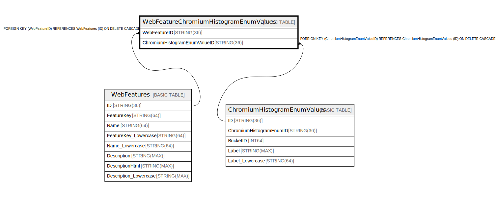

# WebFeatureChromiumHistogramEnumValues

## Description

## Columns

| Name | Type | Default | Nullable | Children | Parents | Comment |
| ---- | ---- | ------- | -------- | -------- | ------- | ------- |
| WebFeatureID | STRING(36) |  | false |  | [WebFeatures](WebFeatures.md) |  |
| ChromiumHistogramEnumValueID | STRING(36) |  | true |  | [ChromiumHistogramEnumValues](ChromiumHistogramEnumValues.md) |  |

## Constraints

| Name | Type | Definition |
| ---- | ---- | ---------- |
| PRIMARY_KEY | PRIMARY_KEY | PRIMARY KEY(WebFeatureID) |

## Indexes

| Name | Definition |
| ---- | ---------- |
| IDX_WebFeatureChromiumHistogramEnumValues_ChromiumHistogramEnumValueID_N_E49E3E19488FE949 | CREATE NULL_FILTERED INDEX IDX_WebFeatureChromiumHistogramEnumValues_ChromiumHistogramEnumValueID_N_E49E3E19488FE949 ON WebFeatureChromiumHistogramEnumValues (ChromiumHistogramEnumValueID) |

## Relations

---

> Generated by [tbls](https://github.com/k1LoW/tbls)
