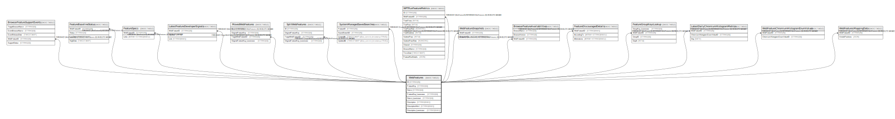

# WebFeatures

## Description

## Columns

| Name | Type | Default | Nullable | Children | Parents | Comment |
| ---- | ---- | ------- | -------- | -------- | ------- | ------- |
| ID | STRING(36) |  | false |  |  |  |
| FeatureID | STRING(64) |  | false | [WPTRunFeatureMetrics](WPTRunFeatureMetrics.md) [BrowserFeatureAvailabilities](BrowserFeatureAvailabilities.md) [FeatureBaselineStatus](FeatureBaselineStatus.md) |  |  |
| Name | STRING(64) |  | false |  |  |  |

## Constraints

| Name | Type | Definition |
| ---- | ---- | ---------- |
| PRIMARY_KEY | PRIMARY_KEY | PRIMARY KEY(ID) |

## Indexes

| Name | Definition |
| ---- | ---------- |
| IDX_WebFeatures_FeatureID_U_784458D34C82F74F | CREATE UNIQUE INDEX IDX_WebFeatures_FeatureID_U_784458D34C82F74F ON WebFeatures (FeatureID) |
| WebFeaturesByFeatureID | CREATE UNIQUE NULL_FILTERED INDEX WebFeaturesByFeatureID ON WebFeatures (FeatureID) |

## Relations

---

> Generated by [tbls](https://github.com/k1LoW/tbls)
