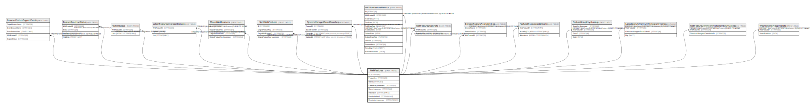

# WebFeatures

## Description

## Columns

| Name | Type | Default | Nullable | Children | Parents | Comment |
| ---- | ---- | ------- | -------- | -------- | ------- | ------- |
| ID | STRING(36) |  | false | [BrowserFeatureSupportEvents](BrowserFeatureSupportEvents.md) [FeatureBaselineStatus](FeatureBaselineStatus.md) [FeatureSpecs](FeatureSpecs.md) [LatestFeatureDeveloperSignals](LatestFeatureDeveloperSignals.md) [MovedWebFeatures](MovedWebFeatures.md) [SplitWebFeatures](SplitWebFeatures.md) [SystemManagedSavedSearches](SystemManagedSavedSearches.md) [WPTRunFeatureMetrics](WPTRunFeatureMetrics.md) [WebFeatureSnapshots](WebFeatureSnapshots.md) [BrowserFeatureAvailabilities](BrowserFeatureAvailabilities.md) [FeatureDiscouragedDetails](FeatureDiscouragedDetails.md) [FeatureGroupKeysLookup](FeatureGroupKeysLookup.md) [LatestDailyChromiumHistogramMetrics](LatestDailyChromiumHistogramMetrics.md) [WebFeatureChromiumHistogramEnumValues](WebFeatureChromiumHistogramEnumValues.md) [WebFeaturesMappingData](WebFeaturesMappingData.md) |  |  |
| FeatureKey | STRING(64) |  | false |  |  |  |
| Name | STRING(64) |  | false |  |  |  |
| FeatureKey_Lowercase | STRING(64) |  | true |  |  |  |
| Name_Lowercase | STRING(64) |  | true |  |  |  |
| Description | STRING(MAX) |  | false |  |  |  |
| DescriptionHtml | STRING(MAX) |  | false |  |  |  |
| Description_Lowercase | STRING(MAX) |  | true |  |  |  |

## Constraints

| Name | Type | Definition |
| ---- | ---- | ---------- |
| PRIMARY_KEY | PRIMARY_KEY | PRIMARY KEY(ID) |

## Indexes

| Name | Definition |
| ---- | ---------- |
| WebFeaturesByFeatureID | CREATE UNIQUE NULL_FILTERED INDEX WebFeaturesByFeatureID ON WebFeatures (FeatureKey) |
| IDX_NAME_LOWER | CREATE INDEX IDX_NAME_LOWER ON WebFeatures (Name_Lowercase) |
| IDX_FEATUREID_LOWER | CREATE INDEX IDX_FEATUREID_LOWER ON WebFeatures (FeatureKey_Lowercase) |

## Relations

---

> Generated by [tbls](https://github.com/k1LoW/tbls)
